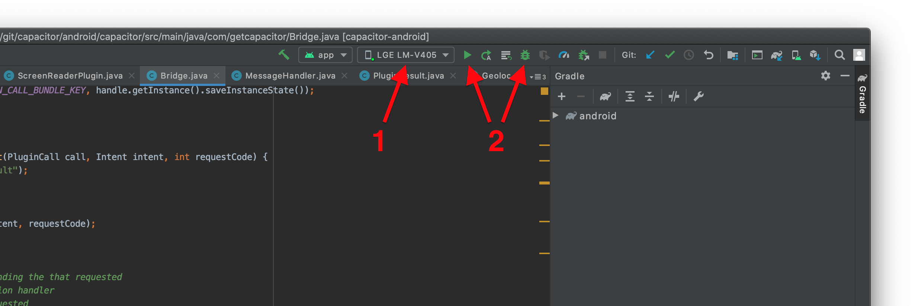

# Google Play Store App Build (Android)

This Guide is for building Google Play Store (Android) applications.  Specifically, this relates to building the Pubilx SAP ERP Mobile Application (*com.pubix.erpmobile*) for submission to the Google Play Store.  The build process for Android apps requires the Android Studio IDE application be installed.

### Getting Started
- If you have not already installed the Capacitor CLI, run the npm scripts to get it installed:
    - `> npm install -g @capacitor/core`
    - `> npm install -g @capacitor/cli`

- If the Amdrpod platform has not been installed, use npm to install it:
    - `> npm install @capacitor/android`
    - `> npx cap add android`

- Build the app using the build script (it will build all platforms):
    - `> npx vite build`

- To run the app on a device or simulator, run:
    - `> npx cap run android`   (you will be prompted to select the target [sim/device])

- To run the app from w/in Android Studio; In Android Studio, first select the device or simulator and then click the 'debug' button to run the app.

### App Build & Deploy
- To open the project in Android Studio, run:
    - `> npx cap open android`

### App Store Submission