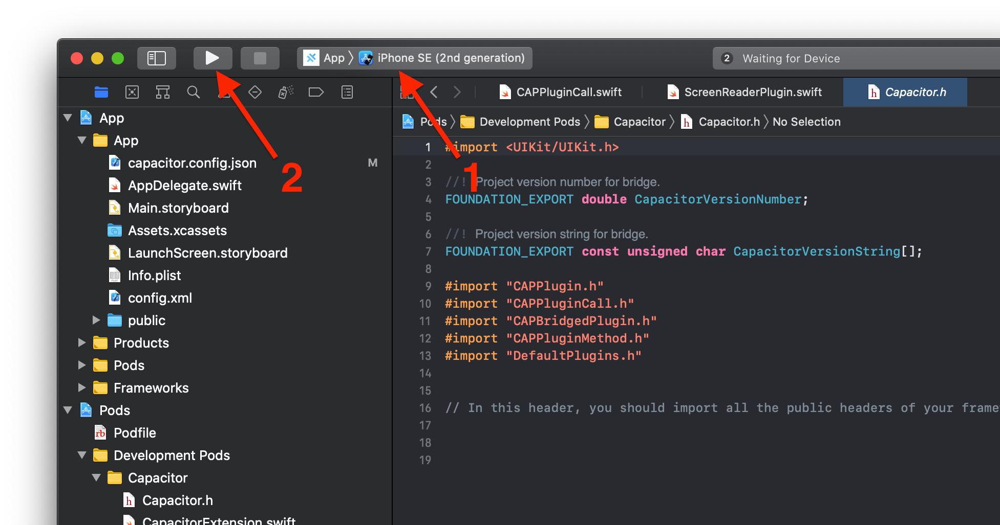

# Apple Store App Build (iOS)

This Guide is for building Apple App Store (iOS) applications.  Specifically, this relates to building the Pubilx SAP ERP Mobile Application (*com.pubix.erpmobile*) for submission to the Apple App Store.  The build process for iOS apps requires the use of a Mac computer running Mac OS with the Xcode IDE application (and all of it's components) installed.

### Getting Started
- If you have not already installed the Capacitor CLI, run the npm scripts to get it installed:
    - `> npm install -g @capacitor/core`
    - `> npm install -g @capacitor/cli`

- If the iOS platform has not been installed, use npm to install it:
    - `> npm install @capacitor/ios`
    - `> npx cap add ios`

- Build the app using the build script (it will build all platforms):
    - `> npx vite build`

- Install the CocoaPods dependency management tool (https://cocoapods.org/):
    - `> sudo gem install cocoapods`

- To run the app on a device or simulator, run:
    - `> npx cap run ios`

- To run the app from w/in Xcode; In Xcode, first select the device or simulator and then click the 'play' button to run the app.

### App Build & Deploy
- To open the project in Xcode, run:
    - `> open ios/App/App.xcworkspace`

### App Store Submission